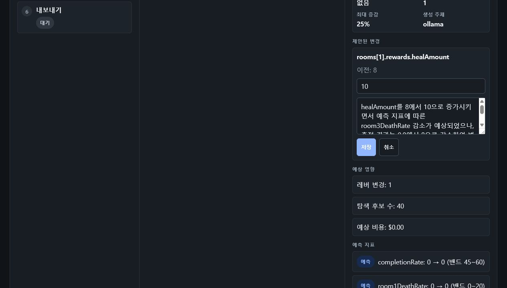
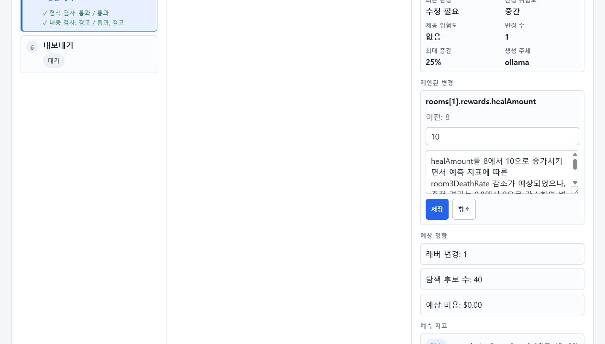

# E2E 마찰 수정 3종 검증

## 참조한 스킬

- `skills/common/directive-writing.md`
- `skills/common/verification.md`
- `skills/domains/dev/file-navigation.md`
- `skills/domains/design/design.md`
- `skills/domains/docs/README.md`
- `browser:control-in-app-browser`

## 변경 경로

- `server/OllamaExecutor.cs`
- `server/Program.cs`
- `dashboard/app.js`
- `dashboard/style.css`
- `dashboard/data/lang/ko.json`
- `dashboard/data/lang/en.json`
- `docs/incidents/2026-07-09-note-feedback-contamination.md`
- `docs/incidents/2026-07-09-approval-idempotency.md`
- `docs/verification/e2e-frictions.md`
- `docs/verification/assets/e2e-frictions-edit-dark.png`
- `docs/verification/assets/e2e-frictions-edit-light.png`

## 실행 기록

| 항목 | 명령 또는 확인 | 결과 | 판정 |
| --- | --- | --- | --- |
| 서버 빌드 | `dotnet build server\LocalFirstWorkflowDashboard.Server.csproj` | 경고 0, 오류 0 | O |
| JS 문법 | `node --check dashboard\app.js` | 문법 오류 없음 | O |
| lang JSON | `node -e "...JSON.parse..."` | ko/en 파싱 성공 | O |
| note 0층 검사 | 서버 DLL 참조 임시 콘솔에서 `OllamaExecutor.HasProhibitedNoteTerm(...)` 호출 | `수정이 필요합니다=True`, 정상 note=False, `측정 결과=True` | O |
| 승인 멱등성 | dev-pack proposal을 임시 `decided`로 바꾼 뒤 `POST /actions/approve` | `409 review.already_decided`, report 21→21, run-log hash 동일, history 46→46 | O |
| 버튼 요청 잠금 | `approveProposal/rejectProposal` 요청 중 `reviewActionRunning`으로 버튼 비활성 | 중복 클릭 진입 차단 | O |
| 편집 버튼 테마 | 브라우저에서 ruined-lab 편집 폼을 열고 양 테마 스크린샷 저장 | 저장/취소 버튼이 라이트·다크 모두 보임 | O |
| 관례 게이트 | `dotnet run --project server --no-build -- measure dev-pack` | `violationCount: 0`, `overallStatus: completed` | O |

## note 위생 확인

임시 콘솔 프로젝트가 서버 DLL을 참조해 `HasProhibitedNoteTerm`을 직접 호출했다.

```text
수정이 필요합니다 -> True
예측 완주율을 높이기 위해 회복량을 조정한다 -> False
측정 결과 완주율이 오른다 -> True
```

이 검사는 실제 Ollama 호출을 대신해 0층 방어 로직만 확인했다. 생성 응답에 판정어가 섞이면 `ParseNoteResponse`가 null을 반환하고 기존 재시도·폴백 경로가 이어진다.

## 승인 멱등성 확인

검증 중 실제 결재 대기 proposal은 승인하지 않았다. dev-pack의 proposal 파일만 임시로 `lifecycle: decided`로 바꿔 서버에 POST했고, 즉시 원본 파일로 되돌렸다.

```json
{
  "Status": 409,
  "Body": "{\"reasonCode\":\"review.already_decided\",\"reason\":\"Proposal is already decided\"}",
  "ReportsBefore": 21,
  "ReportsAfter": 21,
  "ReviewUnchanged": true,
  "RunLogUnchanged": true,
  "HistoryBefore": 46,
  "HistoryAfter": 46
}
```

## 테마 확인

다크 모드:



라이트 모드:



전수 점검 결과:

- `.button`의 직접 색상 `#ffffff`를 `--button-primary-text` 변수로 이동했다.
- `.change-actions .button`과 `.change-actions .button-secondary`에 변수 기반 `color/background/border-color`를 명시했다.
- 추가 인라인 스타일은 발견하지 못했다.
- 정적 지표 추가는 보류했다. `button`의 색상 상속 여부는 컴포넌트 조합과 테마 변수에 따라 달라져 단순 정적 검사가 오탐을 만들 가능성이 높다.

## incident

- `docs/incidents/2026-07-09-note-feedback-contamination.md`
- `docs/incidents/2026-07-09-approval-idempotency.md`

## 관례 게이트

`dotnet run --project server --no-build -- measure dev-pack`를 실행했다.

- `violationCount`: 0
- `proposalLifecycle`: `superseded`
- `currentStage`: `deviationCheck`
- `overallStatus`: `completed`
